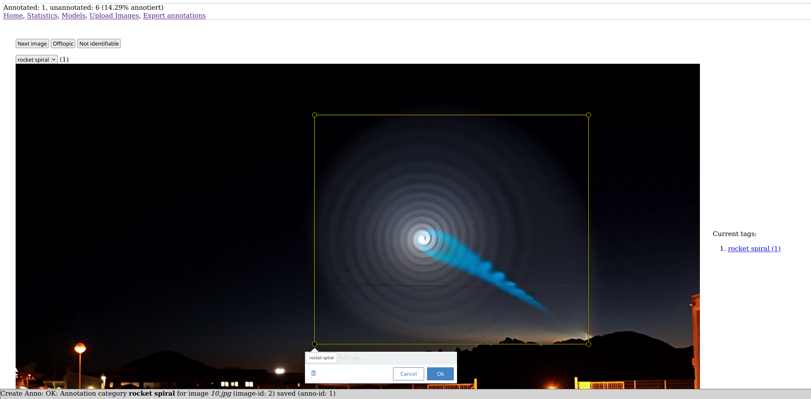

# annotate

A simple No-Code image annotation tool that allows to train AIs locally and import created models to use them for further data annotation and model training.



# Run

Just run

```
git clone --depth 1 https://github.com/NormanTUD/annotate.git
cd annotate
bash docker.sh --local-port 3431
```

It should then run at port 3431.

# What it does

You can upload a bunch of images and annotate them for usage with YoloV11.

You can export them to the YoloV11-format as well.

It is made for large datasets and groups that voluntarily label data. It has a (yet incomplete) curation system.

It also allows you to upload TFJS-models and use the models in the browser to annotate further data.

Imports the trained model, converts it to TensorFlow.js and assists you in further data labelling tasks.
